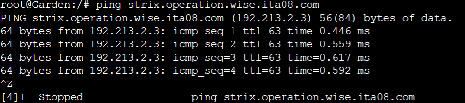

# Jarkom-Modul-2-ITA08-2022

Pengerjaan soal shift jarkom modul 2 oleh ITA08

# Anggota

| Nama                           | NRP          | 
| -------------------------------| -------------| 
| Axellino Anggoro A.              | `5027201040` | 
| Mutiara Nuraisyah Dinda R            | `5027201054` | 
| Brilianti Puspita S.  | `5027201070` |

## Soal 1
WISE akan dijadikan sebagai DNS Master, Berlint akan dijadikan DNS Slave, dan Eden akan digunakan sebagai Web Server. Terdapat 2 Client yaitu SSS, dan Garden. Semua node terhubung pada router Ostania, sehingga dapat mengakses internet 

### Penyelesaian : 
1. Pertama buat topologi sesuai contoh pada soal dan ubah namanya sesuai soal sebagai berikut:


2. Konfigurasi masing-masing node sebagai berikut agar dapat mengakses internet
   - Ostania 
    ```
    auto eth1
    iface eth1 inet static
        address 192.213.1.1
        netmask 255.255.255.0

    auto eth2
    iface eth2 inet static
        address 192.213.2.1
        netmask 255.255.255.0

    auto eth3
    iface eth3 inet static
        address 192.213.3.1
        netmask 255.255.255.0
    ```
    - WISE
    ```
    auto eth0
    iface eth0 inet static
        address 192.213.3.2
        netmask 255.255.255.0
        gateway 192.213.3.1
    ```
    - SSS
    ```
    auto eth0
    iface eth0 inet static
        address 192.213.1.2
        netmask 255.255.255.0
        gateway 192.213.1.1
    ```
    - Garden
    ```
    auto eth0
    iface eth0 inet static
        address 192.213.1.3
        netmask 255.255.255.0
        gateway 192.213.1.1
    ```
    - Berlint
    ```
    auto eth0
    iface eth0 inet static
        address 192.213.2.2
        netmask 255.255.255.0
        gateway 192.213.2.1
    ```
    - Eden
    ```
    auto eth0
    iface eth0 inet static
        address 192.213.2.3
        netmask 255.255.255.0
        gateway 192.213.2.1
    ```

3. Konfigurasi lalu lintas data dari router `Ostania` menggunakan command `iptables -t nat -A POSTROUTING -o eth0 -j MASQUERADE -s 192.213.0.0/16`. 

4. Selanjutnya masukkan command `echo nameserver 192.168.122.1 > /etc/resolv.conf` ke node `WISE, SSS, Garden, Berlint, Eden` sehingga setiap node sekarang sudah dapat mengakses internet
   - WISE
    
   - SSS
    
   - Garden
    
   - Berlint
    
   - Eden
    

## Soal 2
Untuk mempermudah mendapatkan informasi mengenai misi dari Handler, bantulah Loid membuat website utama dengan akses wise.ita08.com dengan alias www.wise.ita08.com pada folder wise

### Penyelesaian :
1. Install bind9 pada DNS Master *WISE*
    ```
    apt-get update
    apt-get install bind9 -y
    ```

2. Tambahkan konfigurasi domain wise.ita08.com dengan command `nano /etc/bind/named.conf.local` kemudian tambahkan script berikut:
   ```
    zone "wise.ita08.com" {
        type master;
        file "/etc/bind/wise/wise.ita08.com";
    };
   ```

3. Buat folder wise dengan command `mkdir /etc/bind/wise` kemudian copy `/etc/bind/db.local` ke `/etc/bind/wise/wise.ita08.com` 

4. Kemudian edit konfigurasi dari file `wise.ita08.com` sebagai berikut:
    

5. Pada client *Garden* dan *SSS* arahkan nameserver ke ip router *WISE* sebagai berikut:
   ```
    nameserver 192.213.3.2 #IP Wise
   ```

6. Ping domain `wise.ita08.com` menggunakan command `ping wise.ita08.com` pada client *Garden* dan *SSS*
    
    

## Soal 3
Setelah itu ia juga ingin membuat subdomain eden.wise.yyy.com dengan alias www.eden.wise.yyy.com yang diatur DNS-nya di WISE dan mengarah ke Eden
### Penyelesaian
### Wise
Tambahkan 3 line baru pada ```/etc/bind/wise/wise.ita08.com``` dengan kode seperti dibawah ini 
```
www             IN      CNAME   wise.ita08.com.
eden            IN      A       192.213.2.3 ;IP Eden
www.eden        IN      CNAME   eden.wise.ita08.com.
```
### Client SSS atau Garden
Jika sudah selesai bisa langsung dilakukan testing dengan perintah 

```ping eden.wise.ita08.com```

Garden
<br>
- Garden
    
- SSS
    
<br>

## Soal 4
Buat juga reverse domain untuk domain utama.
### Penyelesaian
### Wise
Tambhakan kode zone baru pada ```/etc/bind/named.conf.local```
```
zone \"3.213.192.in-addr.arpa\" {
	type master;
	file \"/etc/bind/wise/3.213.192.in-addr.arpa\";
};
```
 Lalu mengcopy konfigurasi db.local dengan perintah seperti berikut ```cp /etc/bind/db.local /etc/bind/wise/3.213.192.in-addr.arpa```

 Kemudian ediy file konfigurasinya di ```/etc/bind/wise/3.213.192.in-addr.arpa```  menjadi seperti dibawah ini
```
;
; BIND data file for local loopback interface
;
\$TTL    604800
@       IN      SOA     wise.ita08.com. root.wise.ita08.com. (
                        2022102501              ; Serial
                         604800         ; Refresh
                          86400         ; Retry
                        2419200         ; Expire
                         604800 )       ; Negative Cache TTL
;
3.213.192.in-addr.arpa.   IN      NS      wise.ita08.com.
2                         IN      PTR     wise.ita08.com
```
### Client SSS atau Garden
Install dnsutils dengan perintah ```apt-get update``` lalu ```apt-get install dnsutils -y``` setelah itu lakukan testing dengan ```host -t PTR 192.213.3.2```

<br>

- Garden


- SSS


<br>

## Soal 5
Agar dapat tetap dihubungi jika server WISE bermasalah, buatlah juga Berlint sebagai DNS Slave untuk domain utama
### Penyelesaian
### Wise
Tambahkan 3 line baru pada ```/etc/bind/named.conf.local``` untuk mengkonfigurasi DNS Slave ke Berlint

```
notify yes;
	also-notify { 192.213.2.2; }; #IP Berlint
	allow-transfer { 192.213.2.2; }; #IP Berlint
```

```
//
// Do any local configuration here
//

// Consider adding the 1918 zones here, if they are not used in your
// organization
//include "/etc/bind/zones.rfc1918";
zone \"wise.ita08.com\" {
	type master;
	notify yes;
	also-notify { 192.213.2.2; };
	allow-transfer { 192.213.2.2; };
	file \"/etc/bind/wise/wise.ita08.com\";
};

zone \"3.213.192.in-addr.arpa\" {
	type master;
	file \"/etc/bind/wise/3.213.192.in-addr.arpa\";
};
```
Lalu untuk melakukan testing DNS Slave berhasil di konfigurasi bind9 Wise harus dimatikan menggunakan perintah ```service bind9 stop```


### Berlint
Pastikan pada Berlint sudah menginstall bind9, jika belum dapat di install dengan perintah ```apt-get update``` dan ```apt-get install bind9 -y```
<br>
Tambahkan zone wise.ita08.com pada ```/etc/bind/named.conf.local``` dengan masters mengarah ke IP Wise

```
//
// Do any local configuration here
//

// Consider adding the 1918 zones here, if they are not used in your
// organization
//include "/etc/bind/zones.rfc1918";

zone \"wise.ita08.com\" {
    type slave;
    masters { 192.213.3.2; }; // IP Wise
    file \"/var/lib/bind/wise.ita08.com\";
};

```
Kemudian jangan lupa untuk melakukan restart bind9 ```service bind9 restart ```
<br>

<br>

### Client SSS atau Garden
Jika sudah menyalakan service bind9 pada Berlint dan mematikan bind9 pada Wise, lakukan ping pada server client SSS atau Garden

- Mematikan bind9 pada Wise


- Garden


- SSS


## Soal 6
Karena banyak informasi dari Handler, buatlah subdomain yang khusus untuk operation yaitu operation.wise.yyy.com dengan alias www.operation.wise.yyy.com yang didelegasikan dari WISE ke Berlint dengan IP menuju ke Eden dalam folder operation
### Penyelesaian
### Wise
Tambahkan 2 line pada ```/etc/bind/wise/wise.ita08.com```
```
ns1             IN      A       192.213.2.2 ;IP Berlint
operation       IN      NS      ns1
```
```
;
; BIND data file for local loopback interface
;
\$TTL    604800
@       IN      SOA     wise.ita08.com. root.wise.ita08.com. (
                        2022102501      ; Serial
                         604800         ; Refresh
                          86400         ; Retry
                        2419200         ; Expire
                         604800 )       ; Negative Cache TTL
;
@               IN      NS      wise.ita08.com.
@               IN      A       192.213.3.2 ;IP Wise
www             IN      CNAME   wise.ita08.com.
eden            IN      A       192.213.2.3 ;IP Eden
www.eden        IN      CNAME   eden.wise.ita08.com.
ns1             IN      A       192.213.2.2 ;IP Berlint
operation       IN      NS      ns1
```

Kemudian pada ```/etc/bind/named.conf.options```, jangan lupa untuk comment line ```dnssec-validation auto;``` dan tambahkan line ```allow-query{any;};``` dibawahnya menjadi seperti ini :

```
options {
        directory \"/var/cache/bind\";
        // If there is a firewall between you and nameservers you want
        // to talk to, you may need to fix the firewall to allow multiple
        // ports to talk.  See http://www.kb.cert.org/vuls/id/800113
        // If your ISP provided one or more IP addresses for stable 
        // nameservers, you probably want to use them as forwarders.  
        // Uncomment the following block, and insert the addresses replacing 
        // the all-0's placeholder.
        // forwarders {
        //      0.0.0.0;
        // };
        //========================================================================
        // If BIND logs error messages about the root key being expired,
        // you will need to update your keys.  See https://www.isc.org/bind-keys
        //========================================================================
        //dnssec-validation auto;
        allow-query{any;};

        auth-nxdomain no;    # conform to RFC1035
        listen-on-v6 { any; };
};
```
Kemudian restart bind9 ```service bind9 restart```
<br>
### Berlint
Lakukan hal yang sama pada ```/etc/bind/named.conf.options```, comment line ```dnssec-validation auto;``` dan tambahkan line ```allow-query{any;};```

Lalu tambahkan kode zone untuk delegasi subdomain pada ```/etc/bind/named.conf.local``` seperti dibawah ini :

```
zone \"operation.wise.ita08.com\" {
    type master;
    file \"/etc/bind/operation/operation.wise.ita08.com\";
};
```

```
//
// Do any local configuration here
//

// Consider adding the 1918 zones here, if they are not used in your
// organization
//include "/etc/bind/zones.rfc1918";

zone \"wise.ita08.com\" {
    type slave;
    masters { 192.213.3.2; }; // IP Wise
    file \"/var/lib/bind/wise.ita08.com\";
};

zone \"operation.wise.ita08.com\" {
    type master;
    file \"/etc/bind/operation/operation.wise.ita08.com\";
};
};
```

Lalu karena diminta untuk menyimpan di folder operation, maka buat folder baru dengan ```mkdir /etc/bind/operation```

<br>

Lalu mengcopy konfigurasi db.local dengan perintah seperti berikut ```cp /etc/bind/db.local /etc/bind/operation/operation.wise.ita08.com```

 Kemudian ediy file konfigurasinya di ```/etc/bind/operation/operation.wise.ita08.com```  menjadi seperti dibawah ini

```
;
; BIND data file for local loopback interface
;
\$TTL    604800
@       IN      SOA     operation.wise.ita08.com. root.operation.wise.ita08.com. (
                        2022102501              ; Serial
                         604800         ; Refresh
                          86400         ; Retry
                        2419200         ; Expire
                         604800 )       ; Negative Cache TTL
;
@       IN      NS      operation.wise.ita08.com.
@       IN      A       192.213.2.3 ;IP Eden
www     IN      CNAME   operation.wise.ita08.com.
```
Kemudian restart bind9 ```service bind9 restart```

### Client Garden atau SSS
Lakukan testing dengan ```ping operation.wise.ita08.com```

- Garden


- SSS


## Soal 7
Untuk informasi yang lebih spesifik mengenai Operation Strix, buatlah subdomain melalui Berlint dengan akses strix.operation.wise.yyy.com dengan alias www.strix.operation.wise.yyy.com yang mengarah ke Eden 
### Penyelesaian
### Berlint
Edit konfigurasi subdomain general pada ```/etc/bind/operation/operation.wise.ita08.com``` dengan menambahkan 2 line seperti dibawah ini

```
strix           IN      A       192.213.2.3 ;IP Eden
www.strix       IN      CNAME   strix.operation.wise.ita08.com.
```

```
;
; BIND data file for local loopback interface
;
\$TTL    604800
@       IN      SOA     operation.wise.ita08.com. root.operation.wise.ita08.com. (
                        2022102501              ; Serial
                         604800         ; Refresh
                          86400         ; Retry
                        2419200         ; Expire
                         604800 )       ; Negative Cache TTL
;
@       IN      NS      operation.wise.ita08.com.
@       IN      A       192.213.2.3 ;IP Eden
www     IN      CNAME   operation.wise.ita08.com.
strix           IN      A       192.213.2.3 ;IP Eden
www.strix       IN      CNAME   strix.operation.wise.ita08.com.

```

Kemudian restart bind9 ```service bind9 restart```

#### Client Garden atau SSS
Bisa dicoba dengan melakukan testing pada client server Garden atau SSS dengan perintah ```ping strix.operation.wise.ita08.com```

- Garden


- SSS


